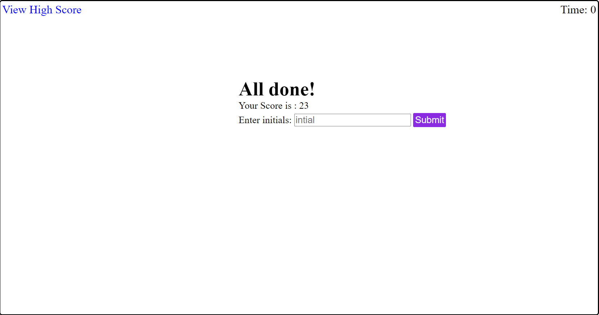

# Timed Code Quiz

## Description

The goal of this project is to build a timed quiz  application on JavaScript basics that stors high scors along with initials based on a user story provided on UW bootcamp Module 4 chalenge. Full content of user story and acceptance criteria is listed under github issue#1 of this repasatory.This application will have a header which contains link to high score section and a contdown timer display , game start section , question section , game end section wihch contains form to submit initial along with score and high score section wich will display stored scors along with corosponding initials and contains a button to clear scors and to go back to quiz start.

## Installation

N/A

## Usage
When timed code quiz   is loaded  quiz start section will be displayed which has title , discription about quiz/scoring , "quiz start" button and headr with "view high score link" and timer display. When "start quiz" button is clicked the first question with choises will be loaded and count down timer started. When answer selected a correct/wrong message will be displayed. If answer is wrong 10sec will be deducted form timer. Then second questin will continue. Quiz end section will be displayed when last question is answered or timer runs out . Score will be displayed on game end page. Once initial is enterd and submit button pressed then score along with initial will be stored and high score page will be displayed with the list of stored scores in oreder from latest to earliest. A "Go back" button will take you to start quiz page and a "clear high scores" button will clear high scores. 
Here is the link to published page https://getnetgit.github.io/Timed_Code_Quiz/ .

[This demo vedio](./asset/media/Timed%20Code%20Quiz_Demo_Video.webm) shows the web application's appearance and functionality:

Timed quiz app pictures  for computer screan

Timed quiz app pictures  for mobile screens

## Credits
I used resorces in UW bootcamp modules and [https://www.w3schools.com/] was also helpful to do some research for this project. 

## License

MIT License

Copyright (c) 2023 GET

Permission is hereby granted, free of charge, to any person obtaining a copy
of this software and associated documentation files (the "Software"), to deal
in the Software without restriction, including without limitation the rights
to use, copy, modify, merge, publish, distribute, sublicense, and/or sell
copies of the Software, and to permit persons to whom the Software is
furnished to do so, subject to the following conditions:

The above copyright notice and this permission notice shall be included in all
copies or substantial portions of the Software.

THE SOFTWARE IS PROVIDED "AS IS", WITHOUT WARRANTY OF ANY KIND, EXPRESS OR
IMPLIED, INCLUDING BUT NOT LIMITED TO THE WARRANTIES OF MERCHANTABILITY,
FITNESS FOR A PARTICULAR PURPOSE AND NONINFRINGEMENT. IN NO EVENT SHALL THE
AUTHORS OR COPYRIGHT HOLDERS BE LIABLE FOR ANY CLAIM, DAMAGES OR OTHER
LIABILITY, WHETHER IN AN ACTION OF CONTRACT, TORT OR OTHERWISE, ARISING FROM,
OUT OF OR IN CONNECTION WITH THE SOFTWARE OR THE USE OR OTHER DEALINGS IN THE
SOFTWARE.
